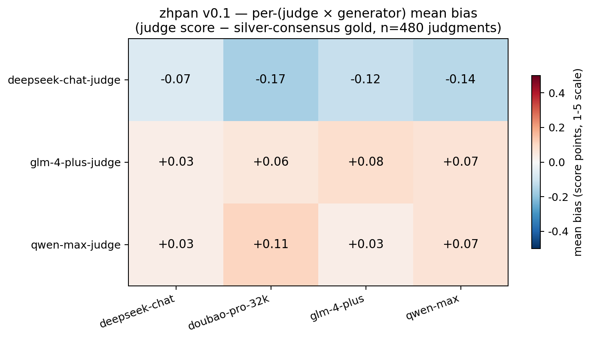

# zhpan · 中评

> 🎯 **Debias Chinese LLM-as-a-Judge in 3 lines.**
> 三行代码消除中文场景下大模型裁判的系统性偏差。

[](https://www.python.org/downloads/)
[](LICENSE)
[]()

---

## What is this?

When you use a Chinese frontier LLM (Qwen / DeepSeek / GLM-4 / Doubao) to **judge** the outputs of other models, that judge does **not** score every generator fairly. `zhpan` measures these **per-(judge × generator)** biases on a 40-prompt Chinese benchmark and gives you a `Calibrator` you can drop into any production data-quality pipeline.

## v0.1 results — first real run

40 curated Chinese prompts × 4 frontier generators × 3 frontier judges = **480 real judgments** against actual production APIs.



**Key findings**:

- 🔴 **DeepSeek-chat-judge is the strictest** — systematically rates every Chinese generator 0.07 to 0.17 points below silver-consensus gold
- 🔵 **GLM-4-plus and Qwen-max judges run slightly lenient** (+0.03 to +0.11 across the board)
- 🤝 **Per-pair bias is smaller than the literature implies for English** — peak magnitude ±0.17 vs. typically ±0.5+ for cross-family English judge pairs
- 🪞 **Self-preference is almost absent** — judges score their own family at +0.01 to +0.07 above other Chinese families, well below the >+0.3 typically reported in English benchmarks
- 📊 **Rank correlations are very high** (0.80–0.95) — Chinese judges agree about *which* model is better, even when their absolute scores drift

**Honest negative result**: at n=40, per-pair offset calibration does **not** improve held-out MAE (5-fold CV: 0.171 → 0.183). The dominant effect is **judge-level overall offset**, not per-pair. We recommend either (a) running calibration only on the overall offset, (b) adding cross-lingual judges (GPT-4o / Claude) where larger per-pair gaps are expected, or (c) growing the prompt set to 200+. See [experiments/EXPERIMENTS.md](experiments/EXPERIMENTS.md) for the full EXP-001 write-up.

Full results: [`leaderboard/v0.1/results.json`](leaderboard/v0.1/results.json), [`leaderboard/v0.1/calibrator.json`](leaderboard/v0.1/calibrator.json).

## Install

```bash
pip install zhpan        # coming soon to PyPI
# or, for now:
git clone https://github.com/Rohawku/zhpan
cd zhpan && pip install -e .
```

## 3-line debias (the whole API)

```python
from zhpan import Calibrator

cal = Calibrator.from_file("leaderboard/v0.1/calibrator.json")
fair = cal.correct(judge="deepseek-chat-judge", generator="doubao-pro-32k", raw_score=3.0)
# → 3.17  (DeepSeek-judge is systematically harsh on doubao, +0.17 corrected)
```

Or from the command line:

```bash
zhpan debias --judge deepseek-chat-judge --gen doubao-pro-32k --score 3.0
# raw=3.00  →  calibrated=3.17  (offset=-0.167, judge=deepseek-chat-judge, gen=doubao-pro-32k)
```

## Try it offline in 30 seconds (no API keys)

```bash
make install
make demo          # full mock pipeline, ~1s
zhpan debias --judge mock-judge-qwen --gen mock-deepseek --score 2.0 \
             --calibrator leaderboard/demo/calibrator.json
```

## Run the full benchmark on real APIs

```bash
cp .env.example .env       # then fill in your 4 API keys
make build-prompts
make benchmark             # generate + judge + analyze, ~¥10 total
```

Supported vendors:
- **dashscope** — 阿里 Qwen
- **deepseek** — DeepSeek
- **zhipu** — 智谱 GLM-4
- **doubao** — 字节豆包 (Volcengine Ark)
- **openai** / **anthropic** / **together** — cross-lingual control

## How it works

1. **Generate.** 40 Chinese prompts × N generators → response set.
2. **Judge.** M judges × all responses on a 1–5 Chinese rubric, temperature 0.
3. **Silver gold.** When ≥2 judges agree (std ≤ 1.0), their average is silver ground-truth.
4. **Bias matrix.** `bias[j][g] = mean(judge_score - silver_gold)` per (judge, generator) pair.
5. **Calibrate.** `Calibrator.correct()` subtracts the learned per-pair offset, clipped to [1, 5]. 5-fold prompt-axis CV reports held-out MAE.

## Project layout

```
zhpan/
├── src/zhpan/         # main package — pip-install target
│   ├── calibrate.py   # Calibrator class
│   ├── compute_bias.py
│   ├── generate.py    # async generation pipeline
│   ├── judge.py       # Chinese rubric LLM judge
│   ├── models.py      # vendor adapters
│   └── cli.py         # `zhpan ...` CLI entry
├── configs/           # v0.1.yaml (real) + demo.yaml (mock)
├── data/prompts/      # 40-item curated Chinese set
├── experiments/       # EXP-XXX run log (EXP-001 = v0.1 baseline)
├── leaderboard/       # released calibrators + heatmaps
└── docs/              # methodology + roadmap
```

## Roadmap

See [docs/ROADMAP.md](docs/ROADMAP.md). v0.2 priorities driven by EXP-001 findings:
- Add cross-lingual judges (GPT-4o / Claude) — per-pair bias should be larger
- Expand prompt set to 200+ via C-Eval / CMMLU / AlignBench
- Add per-category bias breakdown (safety / coding / math may differ)
- Ship pre-built calibrators in the pip package

## Citation

Coming with v0.1 PyPI release.

## License

[MIT](LICENSE)
