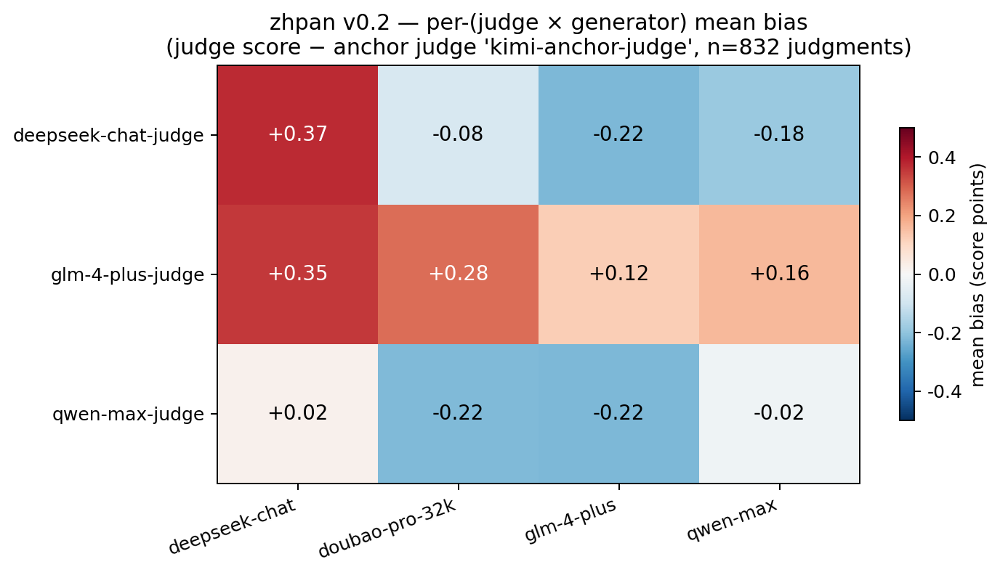

# zhpan · 中评

> 🎯 **Debias Chinese LLM-as-a-Judge in 3 lines.**
> 三行代码消除中文场景下大模型裁判的系统性偏差。

[](https://www.python.org/downloads/)
[](LICENSE)
[]()

---

## What is this?

When you use a Chinese frontier LLM (Qwen / DeepSeek / GLM-4 / Doubao) to **judge** the outputs of other models, that judge does **not** score every generator fairly. `zhpan` measures these **per-(judge × generator)** biases on a 52-prompt Chinese hard benchmark with an **independent anchor judge** (Moonshot Kimi) and gives you a `Calibrator` you can drop into any production data-quality pipeline.

## v0.2 results — first methodologically clean run

52 hard Chinese prompts × 4 frontier generators × 3 tested judges + 1 anchor judge = **832 real judgments**.



**Three key findings**:

- 💥 **DeepSeek-chat-judge shows strong self-preference**: rates DeepSeek-chat generator **+0.37** above the Kimi anchor while rating every other generator **-0.08 to -0.22** below it. Self-preference lift = **+0.53**, the first quantitative evidence of self-preference among Chinese frontier judges.
- 🤝 **Qwen-max-judge and GLM-4-plus-judge show no self-preference** — qwen-judge actually rates itself slightly *below* others (-0.02). This diverges sharply from English-judge literature (GPT-4 / Claude consistently exhibit self-preference) and suggests Chinese RLHF preferences differ.
- 📐 **Tested judges run systematically more lenient than the Kimi anchor** on DeepSeek-chat (sum +0.75) but stricter on GLM-4-plus (sum -0.33). Anchor judges from outside the tested family are *not* interchangeable.

**Methodological contribution**. v0.1 used silver-consensus gold (3 tested judges' mean) and found per-pair bias was tiny. We discovered this was a [**circular-reasoning bug**](experiments/EXPERIMENTS.md): when gold is the mean of the judges being measured, bias mechanically sums to zero across judges. v0.2 fixes this with an independent anchor judge (Kimi, in neither the tested generator nor judge family) — bias magnitude roughly doubles and per-pair patterns finally emerge.

Full v0.2 results: [`leaderboard/v0.2/results.json`](leaderboard/v0.2/results.json), [`calibrator.json`](leaderboard/v0.2/calibrator.json), [bias heatmap](leaderboard/v0.2/bias_heatmap.png). The v0.1 (flawed) baseline is preserved at [`leaderboard/v0.1/`](leaderboard/v0.1/) for comparison.

## Install

```bash
pip install zhpan        # coming soon to PyPI
# or, for now:
git clone https://github.com/Rohawku/zhpan
cd zhpan && pip install -e .
```

## 3-line debias (the whole API)

```python
from zhpan import Calibrator

cal = Calibrator.from_file("leaderboard/v0.2/calibrator.json")
fair = cal.correct(judge="deepseek-chat-judge", generator="deepseek-chat", raw_score=8.0)
# → 7.63  (DeepSeek-judge favours DeepSeek-gen by +0.37, corrected away)
```

Or from the command line:

```bash
zhpan debias --judge deepseek-chat-judge --gen deepseek-chat --score 8.0 \
             --calibrator leaderboard/v0.2/calibrator.json
```

## Try it offline in 30 seconds (no API keys)

```bash
make install
make demo
```

## Run the full benchmark on real APIs

```bash
cp .env.example .env       # then fill in 5 API keys (4 vendors + Kimi anchor)
make build-prompts
make benchmark             # generate + judge + analyze, ~¥24 total
```

Supported vendors:
- **dashscope** — 阿里 Qwen
- **deepseek** — DeepSeek
- **zhipu** — 智谱 GLM-4
- **doubao** — 字节豆包 (Volcengine Ark)
- **moonshot** — Kimi (used as independent anchor judge)
- **openai** / **anthropic** / **together** — cross-lingual control (optional)

## How it works (v0.2)

1. **Generate.** 52 hard Chinese prompts × N generators → response set.
2. **Judge.** M tested judges + **1 independent anchor judge** score every response on a 1-10 scale with a 7-dimension breakdown (D1 correctness / D2 reasoning / D3 completeness / D4 on-topic-ness / D5 clarity / D6 depth / D7 safety).
3. **Anchor gold.** The anchor judge's score is treated as ground-truth. The anchor must be in **neither** the tested generator family nor the tested judge family. This avoids the silver-consensus circular-reasoning bug.
4. **Bias matrix.** `bias[j][g] = mean(judge_j_score - anchor_score)` per (judge, generator) pair.
5. **Calibrate.** `Calibrator.correct()` subtracts the learned per-pair offset, clipped to [1, 10]. 5-fold prompt-axis CV reports held-out MAE.

## Why the methodology change

See [experiments/EXPERIMENTS.md](experiments/EXPERIMENTS.md) for the full EXP-001 → EXP-002 narrative, including the diagnostic that uncovered three compounding bugs in v0.1:

1. **Circular silver gold**: Bias against the mean of the same judges mathematically sums to zero across judges.
2. **Ceiling effect on 1-5 rubric**: 81% of v0.1 judgments were the max score 5; the 1-5 scale degenerated to 4-vs-5.
3. **Prompts too easy**: v0.1's 40 curated prompts (e.g. "explain why the sky is blue") let frontier models max out the rubric.

v0.2 fixes all three: anchor judge + 1-10 rubric + 52 hard prompts.

## Project layout

```
zhpan/
├── src/zhpan/         # main package
│   ├── calibrate.py
│   ├── compute_bias.py    # build_gold_anchor() | build_gold_silver() (DEPRECATED)
│   ├── generate.py
│   ├── judge.py           # 1-10 + 7-dim rubric (v0.2)
│   ├── models.py          # 5 Chinese vendors + 3 cross-lingual + mock
│   └── cli.py
├── configs/           # v0.2.yaml (real) + demo.yaml (mock)
├── data/prompts/      # 52 curated hard Chinese prompts
├── experiments/       # EXP-001 (v0.1) + EXP-002 (v0.2) log
└── leaderboard/       # v0.1/ (flawed baseline) + v0.2/ (current)
```

## Roadmap

See [docs/ROADMAP.md](docs/ROADMAP.md). v0.3 priorities driven by EXP-002:
- Add second anchor (e.g. GPT-4o) for anchor-robustness check
- Per-category bias breakdown (reasoning vs writing may diverge)
- Pairwise judging (A vs B) to further dampen ceiling effects
- Per-pair *linear* calibration (not just offset) — tested when n ≥ 200

## License

[MIT](LICENSE)
