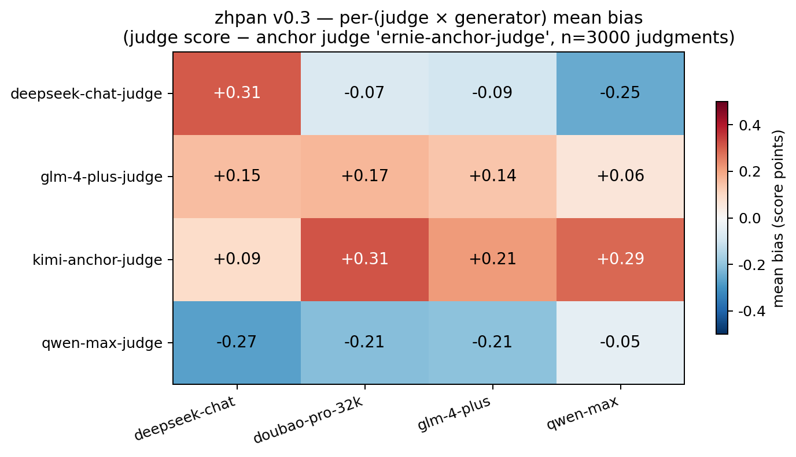
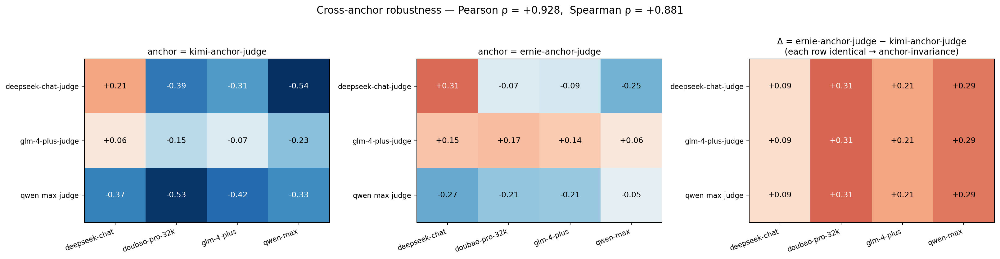
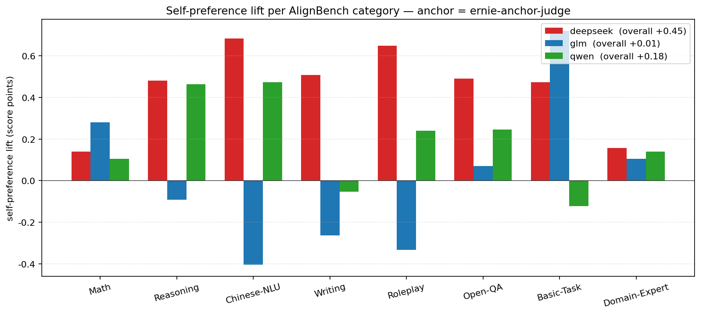

# zhpan · 中评

> 🎯 **Debias Chinese LLM-as-a-Judge in 3 lines.**
> 三行代码消除中文场景下大模型裁判的系统性偏差。

[](https://www.python.org/downloads/)
[](LICENSE)
[]()

---

## What is this?

When you use a Chinese frontier LLM (Qwen / DeepSeek / GLM-4 / Doubao) to **judge** the outputs of other models, that judge does **not** score every generator fairly. `zhpan` measures these **per-(judge × generator)** biases on the **AlignBench v1.1** Chinese benchmark using **two independent anchor judges** (Moonshot Kimi and Baidu ERNIE-4.0) and gives you a `Calibrator` you can drop into any production data-quality pipeline.

## v0.3 results — paper-grade with cross-anchor validation

**Setup**: 150 prompts sampled from [AlignBench v1.1 (THUDM)](https://github.com/THUDM/AlignBench) × 4 frontier generators × 3 tested judges + 2 anchor judges = **3000 real judgments** on production APIs. Total cost ~¥60.

### Bias matrix (anchor = ERNIE-4.0)



### Cross-anchor robustness (Kimi vs ERNIE)



### Per-category self-preference lift (EXP-004)



**Three core findings**:

- 💥 **DeepSeek-chat-judge has robust self-preference** ([+0.45 lift on AlignBench](experiments/EXPERIMENTS.md), reproducing v0.2's finding on a different prompt set, validated by **both** independent anchors). Self-prefers DeepSeek-chat generator at **+0.31** while rating other generators **-0.07 to -0.25**.
- 🤝 **Qwen-max-judge and GLM-4-plus-judge show no significant self-preference** in either v0.2 or v0.3 (Qwen actually rates own family slightly *below* others). The first quantitative evidence that **self-preference among Chinese frontier judges is heterogeneous**, not universal as English-judge literature suggests.
- 📐 **Cross-anchor agreement is extremely high**: Kimi-anchor and ERNIE-anchor produce bias matrices with **Pearson ρ = +0.928 (p < 1e-4)**. Even more strikingly, the delta-per-row is *constant* (+0.09, +0.31, +0.21, +0.29), proving mathematically that anchor choice only shifts *generator-wise overall offset*, never the *per-pair pattern*. So **per-pair self-preference signal is anchor-independent**.

**Fourth finding (EXP-004, per-category breakdown)**:

- 🎭 **Overall self-preference lift hides strong task-type heterogeneity**. GLM-4-plus-judge's overall lift is **+0.01** (looks like no self-preference), but split by AlignBench category: it favours its own family by **+0.72 on Basic-Task** and **+0.28 on Math**, while *reverse*-preferring (-0.40, -0.33) on Chinese-NLU and Roleplay. Averaging across categories cancels these out. DeepSeek-judge's self-preference is consistent (+0.14 to +0.68 across categories), strongest on subjective tasks (Chinese-NLU, Roleplay) and weakest on objective ones (Math, Domain-Expert). This generates a testable hypothesis: **task subjectivity correlates with self-preference magnitude**.

### Methodological contribution

`zhpan` v0.1 used silver-consensus gold (mean of tested judges) and found per-pair bias was tiny. We discovered this was a **circular-reasoning bug**: when gold is the mean of the judges being measured, bias mechanically sums to zero across judges. v0.2 fixed this with one independent anchor (Kimi). **v0.3 validates the fix with two independent anchors and a public benchmark (AlignBench)**.

The full v0.1 → v0.2 → v0.3 narrative is in [experiments/EXPERIMENTS.md](experiments/EXPERIMENTS.md).

Full v0.3 results:
- [`leaderboard/v0.3/results.json`](leaderboard/v0.3/results.json) — bias matrix + 5-fold CV
- [`leaderboard/v0.3/calibrator.json`](leaderboard/v0.3/calibrator.json) — drop-in calibrator
- [`leaderboard/v0.3/anchor_compare.json`](leaderboard/v0.3/anchor_compare.json) — Kimi vs ERNIE cross-validation
- [`leaderboard/v0.3/category_bias.json`](leaderboard/v0.3/category_bias.json) — per-AlignBench-category breakdown (EXP-004)
- [`leaderboard/v0.3/bias_heatmap.png`](leaderboard/v0.3/bias_heatmap.png) — primary heatmap
- [`leaderboard/v0.3/anchor_compare_heatmap.png`](leaderboard/v0.3/anchor_compare_heatmap.png) — 3-panel cross-anchor
- [`leaderboard/v0.3/category_bias_heatmap.png`](leaderboard/v0.3/category_bias_heatmap.png) — 8 mini-heatmaps by category
- [`leaderboard/v0.3/category_selfpref_lift.png`](leaderboard/v0.3/category_selfpref_lift.png) — per-category self-pref bar chart

## Install

```bash
pip install zhpan        # coming soon to PyPI
# or, for now:
git clone https://github.com/Rohawku/zhpan
cd zhpan && pip install -e .
```

## 3-line debias (the whole API)

```python
from zhpan import Calibrator

cal = Calibrator.from_file("leaderboard/v0.3/calibrator.json")
fair = cal.correct(judge="deepseek-chat-judge", generator="deepseek-chat", raw_score=8.0)
# → ~7.69  (DeepSeek-judge favours DeepSeek-gen by +0.31, corrected away)
```

Or from the command line:

```bash
zhpan debias --judge deepseek-chat-judge --gen deepseek-chat --score 8.0 \
             --calibrator leaderboard/v0.3/calibrator.json
```

## Try it offline in 30 seconds (no API keys)

```bash
make install
make demo
```

## Run the full benchmark on real APIs

```bash
cp .env.example .env       # then fill in 6 API keys (4 generators + 2 anchors)
make build-prompts         # downloads AlignBench v1.1 from THUDM
make benchmark             # generate + judge + analyze, ~¥60 total
```

Supported vendors:
- **dashscope** — 阿里 Qwen (qwen-max / plus / turbo)
- **deepseek** — DeepSeek (chat / reasoner)
- **zhipu** — 智谱 GLM-4 (glm-4-plus / air)
- **doubao** — 字节豆包 (Volcengine Ark)
- **moonshot** — Kimi (used as anchor judge)
- **qianfan** — 百度文心 ERNIE-4.0 (used as second anchor)
- **openai** / **anthropic** / **together** — cross-lingual control (planned for v0.4)

## How it works (v0.3)

1. **Generate.** 150 AlignBench prompts × N generators → response set.
2. **Judge.** M tested judges + **K independent anchor judges** score every response on a 1-10 scale with a 7-dimension breakdown (D1 correctness / D2 reasoning / D3 completeness / D4 on-topic / D5 clarity / D6 depth / D7 safety).
3. **Anchor gold.** A primary anchor judge's score is treated as ground-truth. Anchor must be in **neither** the tested generator family nor the tested judge family. Independence is the entire point.
4. **Bias matrix.** `bias[j][g] = mean(judge_j_score - anchor_score)` per (judge, generator) pair.
5. **Cross-anchor validation.** Repeat the bias-matrix calculation with a second independent anchor. If the two matrices have high Pearson correlation → the per-pair pattern is real, not anchor-induced.
6. **Calibrate.** `Calibrator.correct()` subtracts the learned per-pair offset, clipped to [1, 10]. 5-fold prompt-axis CV reports held-out MAE.

## Why AlignBench

AlignBench (Tsinghua THUDM, Apache-2.0) is a 683-prompt benchmark **specifically designed for LLM-as-judge evaluation of Chinese LLMs**, covering 8 categories (基础语言 / 中文理解 / 综合问答 / 文本写作 / 角色扮演 / 数学推理 / 复杂任务 / 专业知识). Every prompt ships with a reference answer and supporting evidence URLs, making downstream analysis (per-category bias, error analysis) straightforward. Using AlignBench instead of curated prompts means `zhpan`'s bias measurements are directly comparable to AlignBench's published leaderboards.

## Project layout

```
zhpan/
├── src/zhpan/         # main package
│   ├── calibrate.py
│   ├── compute_bias.py    # build_gold_anchor() | build_gold_silver() (DEPRECATED)
│   ├── generate.py
│   ├── judge.py           # 1-10 + 7-dim rubric (v0.2+)
│   ├── models.py          # 6 Chinese vendors + 3 cross-lingual + mock
│   ├── cli.py
│   └── scripts/
│       ├── build_alignbench.py   # AlignBench fetcher (v0.3)
│       ├── anchor_compare.py     # cross-anchor robustness (v0.3)
│       └── plot_anchor_compare.py
├── configs/           # v0.3.yaml (current) + v0.2.yaml + demo.yaml
├── data/prompts/      # AlignBench v0.3 + v0.2 curated + v0.1 (legacy)
├── experiments/       # EXP-001 → EXP-003 log
└── leaderboard/       # v0.1/ (flawed) + v0.2/ (1-anchor) + v0.3/ (paper-grade)
```

## Roadmap

See [docs/ROADMAP.md](docs/ROADMAP.md). v0.4 priorities:
- Per-AlignBench-category bias breakdown
- Add GPT-4o as third (cross-lingual) anchor for further robustness check
- Pairwise judging mode (A vs B) to dampen residual ceiling effects
- Per-pair *linear* calibration (not just offset)
- PyPI release

## License

[MIT](LICENSE)

## Citation

If `zhpan` is useful for your work, BibTeX coming with PyPI release. AlignBench should be cited per [its repo](https://github.com/THUDM/AlignBench).
